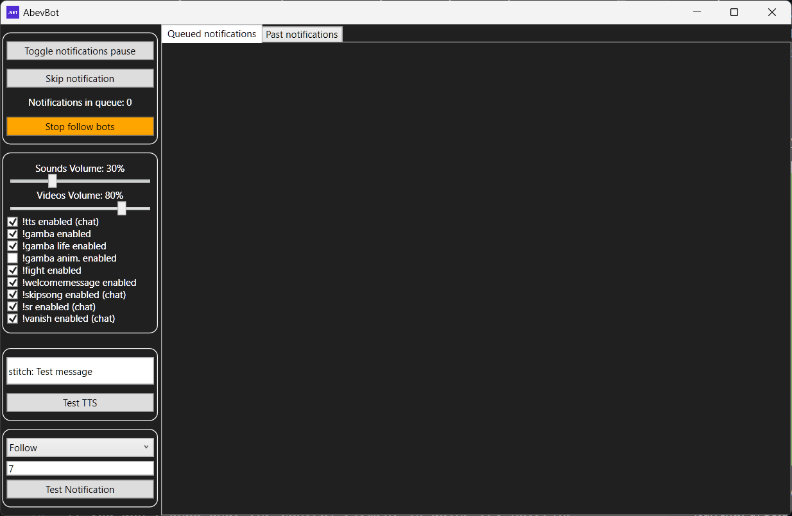

# AbevBot - Another Twitch Bot
Programmed with C# on .NET 7. 
Requires .NET 7 SDK (or newer) to build: https://dotnet.microsoft.com/download. 
To run the bot, .NET Desktop Runtime 7 (or newer) is required https://dotnet.microsoft.com/en-us/download/dotnet/7.0. It's included in the SDK, but if you just downloaded bot's release package and don't need entire SDK, the runtime will be sufficient.

The bots source code is modular - the functionalities are divided among .cs files. 

The bot uses Windows Presentation Foundation (WPF, an UI framework) to open configuration window. WPF only supports Windows. The configuration window is used for easy control over most of its features while the bot is running (without restarts). The settings are saved into local database and loaded on each startup. If you don't know what the control element is doing try hovering over it to see the tooltip message. 

## **Bot Configuration**
Bots configuration is carried out in:
- `Secrets.ini` file - Twitch app data: customer ID, passwords, etc.,
- `Config.ini` file - channel name, bot notifications configuration, etc.,
- `ResponseMessages.csv` file - automated response messages.

Configuration files (`Secrets.ini`, `Config.ini`, etc.) are generated automatically when the bot is launched. If the files are missing run the bot once for them to be generated. 
Changes in `Config.ini` and `ResponseMessages.csv` files are hot reloaded (no bot restart is required to load changes). 
Setting up the bot can be overwhelming to do everything at once - check out the [Required information](#required-information) section in the readme to get started with essentials. 
The steps required to configure the bots functionalities are described in the configuration files. 
Additional options can be configured later and should not require more than 10 minutes per section.

The bot uses SQL database file (`.db`) to save runtime bot data: OAuth tokens, bot control elements statuses, etc. 
> [!warning]
> ***DON'T SHARE THE `.db` and `Secrets.ini` FILES WITH ANYONE!***

Chatters data is stored in `.chatters` file.

## **OBS configuration**
The bot offers two possibilities for presenting received notifications in OBS:
  - Adding browser source from local file
  

  - Adding browser source from locally hosted server (by the bot) at http://127.0.0.1:40000 
  

For the best results I suggest setting up width and height of the OBS browser source to resolution of your monitor. Most commonly used resolution is 1920x1080 (width: 1920, height: 1080). 
Browser source from local file may be better option because OBS will open the bots website even when the bot is not running and it will wait for the bot to be started (using other approach may require refreshing browser source in OBS when the OBS is stared before the bot). 

## **Features**
1. Integrates Twitch IRC chat:
    - Reads messages,
    - Can replay to configured keys in read messages (automated responses),
    - Detects custom rewards messages which require redeemer to type something in chat,
    - Detects bits messages which require cheerer to type something in chat,
    - Detects badges owned by message author (MOD, SUB, VIP, etc.),
    - Detects bots messages,
    - Detects special messages:
      - Subscriptions,
      - Gifted subscriptions (distinguishes between random and to specific user),
      - Upgrade from prime subscription,
      - Announcements,
      - Raids.
    - Detects bans and timeouts,
    - Detects changes in chat emote-only mode,
    - Sends periodic messages configured in Config.ini file,
    - Can be run without broadcaster permissions.

2. Subscribes to EventSub (Twitch events):
    - Subscribes to follow notification event,
    - Subscribes to subscriptions notifications events (there are multiple subscription types),
    - Subscribes to bits cheer event,
    - Subscribes to channel points custom rewards redemptions events,
    - Uses StreamElements and TikTok api for TTS generation.

3. Implements chat interactions / commands:
    - Text To Speech (`!tts`),
    - Spotify integration (`!song`, `!previoussong`, `!songrequest` (requires Spotify premium), `!sr` (requires Spotify premium), `!skipsong` (requires Spotify premium), `!songqueue` (requires Spotify premium)), 
 

    - Gambling (`!gamba`), 

    - Fighting (`!fight`), 

    - Backseat points (`!point`) - the streamer can reward the chatter for helping, 

    - Rude points (`!rude`) - chatters can point a chatter for being rude, 

    - Vanish (`!vanish`) - self timeout for the chatter, also deletes chatter messages.
    - Hug (`!hug`) - just a friendly hug to other person.
    - Counters (`!counter`) - on screen counters. Hosted at "http://127.0.0.1:40000/counter" or by opening "server/counter.html" file. Adding it to OBS is the same as described in [OBS configuration](#obs-configuration), just the address/path is different. 

4. Discord integration:
    - Sends message to the Discord channel when the stream goes live.

## **Required information**
### Secrets.ini
The file will be generated automatically the first time the bot is launched.
  - Bot's name (`Name`) - Name of the registered application on https://dev.twitch.tv/console/apps.
  - Bot's client ID (`CustomerID`) - Customer ID of the registered application on https://dev.twitch.tv/console/apps.
  - Bot's password (`Password`) - Customer password of the registered application on https://dev.twitch.tv/console/apps.

### Config.ini
The file will be generated automatically the first time the bot is launched.
  - Channel name (`ChannelName`) - Name of the channel to connect to.
