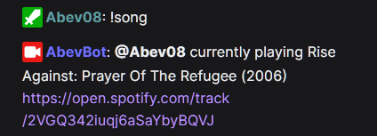

# AbevBot - Another Twitch Bot
Programmed with C# on .NET 7. 
Requires .NET 7 SDK (or newer) to build: https://dotnet.microsoft.com/download. 
To run the bot, .NET Desktop Runtime 7 (or newer) is required https://dotnet.microsoft.com/en-us/download/dotnet/7.0. It's included in the SDK, but if you just downloaded bot's release package and don't need entire SDK, the runtime will be sufficient.

The bot sourcecode is modular - the functionalities are divided among .cs files. 
The bot uses Windows Presentation Foundation (WPF, an UI framework) to open bot's configuration window. The window should also be used as OBS input (the 'greenscreen' part of the window) for capturing displayed notifications. 
Because WPF is used can be built only for Windows.

To remove the 'greenscreen', chroma key filter for green and similarity value ~340 should be added to the OBS input. 
The 'greenscreen' solution is not perfect and will affect the display of videos and clips that use the color green.

The bot's control elements are located on the left side of the window. 
They can be used to control the behavior of the bot while it is running (without restarts). 
If you don't know what the control element is doing try hovering over it to see the tooltip message.

Bot's configuration is carried out in:
- `Secrets.ini` (Twitch app data: customer ID, passwords, etc.),
- `Config.ini` (channel name, bot notifications configuration, etc.),
- `ResponseMessages.csv` (automated response messages).

Configuration files (`Secrets.ini`, `Config.ini`, etc.) are generated automatically when the bot is lanuched. 
Changes in `Config.ini` and `ResponseMessages.csv` files are hot reloaded (no bot restart is required to load changes). 
Setting up the bot can be overwhelming to do everything at once - check out the 'Required information' sections in the readme to get started with essentials. 
The steps required to configure the bot's functionalities are described in the configuration files. 
Additional options can be configured later and should not require more than 10 minutes per seciton.

The bot uses SQL database file (`.db`) to save runtime bot data: OAuth tokens, bot control elements statuses, etc. 
***DON'T SHARE THE `.db` FILE WITH ANYONE!*** 
Chatters data is stored in `.chatters` file. 
Both files are generated automatically when the bot is launched.

## **Features**
1. Integrates Twitch IRC chat:
    - Reads messages,
    - Can replay to configured keys in read messages (automated responses),
    - Detects custom rewards messages which require redeemer to type something in chat,
    - Detects bits messages which require cheerer to type something in chat,
    - Detects badges owned by message author (MOD, SUB, VIP, etc.),
    - Detects bots messages,
    - Detects special messages:
      - Subscriptions,
      - Gifted subscriptions (distinguishes between random and to specific user),
      - Upgrade from prime subscription,
      - Announcements,
      - Raids.
    - Detects bans and timeouts,
    - Detects changes in chat emote-only mode,
    - Sends periodic messages configured in Config.ini file,
    - Can be run without broadcaster permissions.

2. Subscribes to EventSub (Twitch events):
    - Subscribes to follow notification event,
    - Subscribes to subscriptions notifications events (there are multiple subscription types),
    - Subscribes to bits cheer event,
    - Subscribes to channel points custom rewards redemptions events,
    - Uses StreamElements api for TTS generation.

3. Implements chat interactions / commands:
    - Text To Speech (`!tts`),
    - Spotify integration (`!song`, `!previoussong`, `!songrequest` (requires Spotify premium), `!sr` (requires Spotify premium), `!skipsong` (requires Spotify premium), `!songqueue` (requires Spotify premium)), 
 

    - Gambling (`!gamba`), 

    - Fighting (`!fight`), 

    - Backseat points (`!point`) - the streamer can reward the chatter for helping, 

    - Rude points (`!rude`) - chatters can point a chatter for being rude, 

    - Vanish (`!vanish`) - self timeout for the chatter, also deletes chatter messages.
    - Hug (`!hug`) - just a friendly hug to other person.

4. Discord integration:
    - Sends message to the Discord channel when the stream goes live.

## **Required information in Secrets.ini**
The file will be generated automatically the first time the bot is launched.
  - Bot's name (`Name`) - Name of the registered application on https://dev.twitch.tv/console/apps.
  - Bot's client ID (`CustomerID`) - Customer ID of the registered application on https://dev.twitch.tv/console/apps.
  - Bot's password (`Password`) - Customer password of the registered application on https://dev.twitch.tv/console/apps.

## **Required information in Config.ini**
The file will be generated automatically the first time the bot is launched.
  - Channel name (`ChannelName`) - Name of the channel to connect to.
