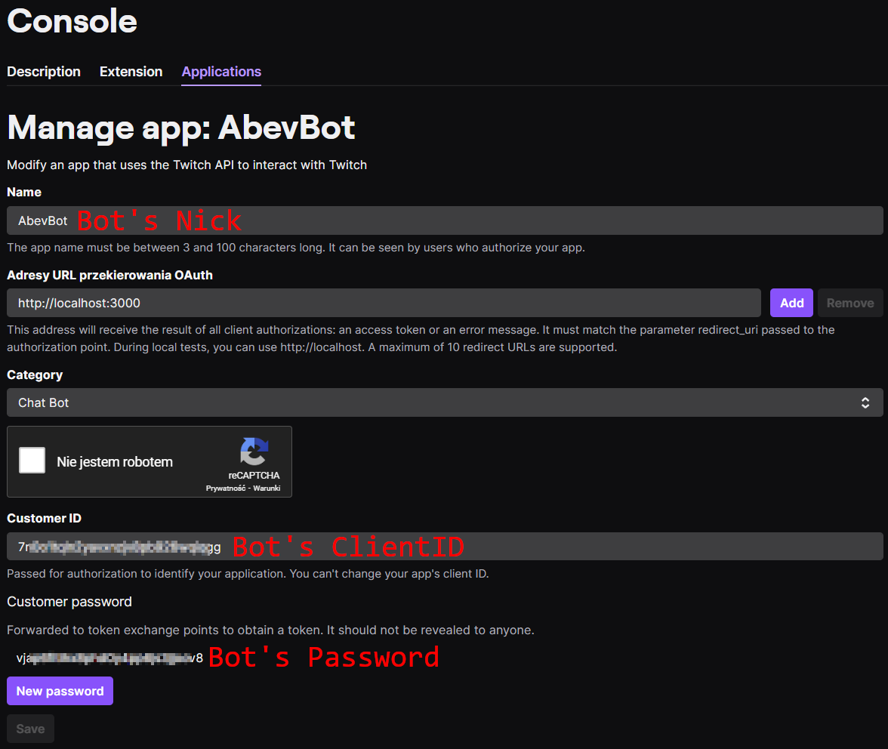
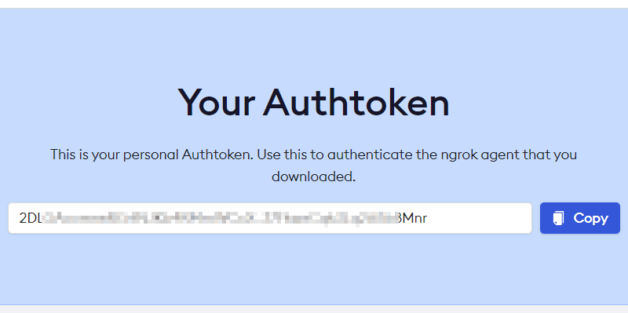
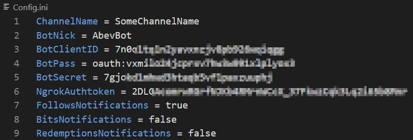

# AbevBot - WPF
Almost the same as Console version but uses Windows Presentation Foundation (WPF). WPF is used instead of SFML, which grants higher level of abstraction on graphical interface (like premade user controls). Can display videos and play audio clips. Because WPF is used can be built only for Windows.
  

## **Features**
- Integrates Twitch IRC chat:
  - Reads messages,
  - Can replay to configured keys in read messages (automated responses),
  - Detects custom rewards messages which require redeemer to type something in chat,
  - Detects bits messages which require cheerer to type something in chat,
  - Detects badges owned by message author (MOD, SUB, VIP, etc.),
  - Detects bots messages,
  - Detects special messages:
    - Subscriptions,
    - Gifted subscriptions (distinguishes between random and to specific user),
    - Upgrade from prime subscription,
    - Announcements,
    - Raids.
  - Detects bans and timeouts,
  - Detects changes in chat emote-only mode,
  - Can be run without broadcaster permissions (only with app access token).
- Subscribes to EventSub (Twitch events):
  - Creates local server on which listens to Twitch event messages,
  - Acquires new authentication tokens. If the user required features that require user access token the bot opens browser tab and asks for permission,
  - Subscribes to follow notification event. Can be disabled in Config.ini,
  - Subscribes to custom reward redemption event. Can be disabled in Config.ini,
  - Subscribes to bits cheer event. Can be disabled in Config.ini,
  - Uses ngrok (https://ngrok.com) to tunnel HTTP messages to local server. This way it works without public IP address,
  - Uses StreamElements api for TTS generation.
  - Some subscriptions require broadcaster permissions. For example follow notifications can be used without broadcaster permission.
- Bot configuration is carried out in:
  - Config.ini,
  - ResponseMessages.csv.
  

## **Some explanation of source code**
- `Chat.cs` - Implements chat integration.
  - Chat part of the bot is started with `Chat.Start()` function.
  - After `Chat.Start()` is called:
    - Automated responses are loaded with `LoadResponseMessages()`,
    - Then new `Thread` is started in which chat part of the bot will be running,
    - Inside created `Thread` new `Socket` with `Tcp` parameters is created - it will be used to receive and send messages,
    - Then `BackgroundWorker` is created for asynchronous handling of messages receiving.
    - Then to created `BackgroundWorker` is assigned new function (delegate) which would be executed when `BackgroundWorker.Start()` is called,
    - Below that function infinite `while` loop is created to handle connecting to IRC server and starting / stopping `BackgroundWorker`,
    - Inside the infinite `while` loop created `Socket` tries to connect (`socket.Connect()`) to Twitch IRC address on predefined port,
    - Next starts created `BackgroundWorker` (`receiveWorker.RunWorkerAsync()`) and sends required information to log in into IRC chat with `socket.Send()`,
    - The main `Thread` of `Chat.cs` is then put to sleep while connection is active,
    - If the connection to Twitch IRC is closed the `BackgroundWorker` is stopped and the main `Thread` waits 2 seconds to try connecting again.
  - Inside `receiveWorker.DoWork()`:
    - `while` loop is used to continue receiving messages while connection is active,
    - `ManualResetEvent` with asynchronous functions `socket.BeginReceive()` and `socket.EndReceive()` is used to asynchronously receive messages and to act like it's event driven,
    - `socket.BeginReceive()` starts receiving message. When the message is received `socket.BeginReceive()` calls `AsyncCallback` declared in it's call,
    - Receive of the message is ended with `socket.EndReceive()` call,
    - Next received `bytes` are converted to `string[]` with use of `Split()`. Every IRC message send by Twitch have to end with "`\r\n`",
    - If the message doesn't end with "`\r\n`" probably fragmented message is received (IRC packet can't exceed 4096 bytes) so that message is moved to beggining of `receiveBuffer` and new messages are appended after it,
    - Received message is then split into "head" (`message[0]`) and "body" (`message[1]`) part. In which "head" is IRC specific data and "body" is the actual message send by the user. This approach doesn't allow users to mess with the bot.
    - Then each received message is parsed. In the parsing process static keywords like "`PING`", "`PRIVMSG`", etc. are being searched in "head" part of the message.
  - Inside `LoadResponseMessages()` configuration file `ResponseMessages.csv` is being parsed and keys are added to `Dictionary<string, (string, DateTime)>`. Each key in that dictionary uses `Tuple` as value - `Item1` of that tuple is actual message that should be send to chat and `Item2` is timestamp when that message was last being send. Sending automated messages checks if passed more than `CooldownBetweenTheSameMessage` time from last message send.
- `Events.cs` - Implements events integration.
  - Event part of the bot is started with `Events.Start()` function.
  - After `Events.Start()` is called:
    - HTTP tunnel to local server is created with `GetLocalTunnel()` call. If creation of HTTP tunnel fails the `Events` initialization process is interrupted. Without that tunnel other parts of `Events` wouldn't work,
    - Then local server is created with `LocalServer.Start()`,
    - Then new app access token (and if required user access token) is acquired  with `GetNewAccessToken()` call,
    - In subscriptions `POST` messages broadcaster ID is required but it could be troublesome for random user to know that so from defined `ChannelName` in `Config.ini` broadcasterID is acquired ,
    - Then previously subscribed events are acquired and deleted. Why? Because ngrok tunnel URL could change and previous subscriptions wouldn't work anymore,
    - Then `new Thread()` is stated for listening to Twitch event messages redirected by ngrok to local server,
    - Then subscribing to Twitch events is carried out with `POST` requests.
  - Inside `GetNewAccessToken()`:
    - If user access token is being required:
      - New web browser tab is being opened with link to provide the bot required permissions,
      - If the user provides the bot permissions the callback redirects user click to local server,
      - The acquired authentication token is visible in URL so the bot quickly redirects the user to hide it,
      - Then with acquired authentication token bot acquires user access token.
    - App access token is acquired with bot `BotClientID` and `BotSecret` configured in `Config.ini`.
  - Inside `GetLocalTunnel()`:
    - At first "`ngrok.exe`" presence is being checked,
    - Then new `cmd.exe` process that runs `ngrok.exe` is being created. `Ngrok.exe` have to be running as long as HTTP tunnel to local server have to be active,
    - Then using `ngrok` api tunnel URL is being acquired.
  - Inside `ParseServerRequest()`:
    - Received `Json` objects are being parsed.
  - Inside `ClearPreviousEventSubscriptions()`:
    - Firstly previous subscriptions are being acquired with `GET` request,
    - Then each acquired subscription is being deleted with `DELETE` request.
  - `ParseSubscribeResponse()` is being used to parse subscribe `POST` request. If the bot doesn't have permissions to subscribe to required event Twitch API sends it in `POST` request response not actual event message.
  - `GetTTS()` is being used to acquire audio stream from StreamElements api.
- `Audio.cs` - Implements playing audio clips. For now there is only one function `PlaySound()` to create new audio playing object. The call to it is created in `Events.GetTTS()` in which it's encapsulated in `new Thread` so each new sound is a `new Thread` and they could be playing at the same time. Some buffering is required to be implemented.
- `Config.cs` - Implements bot configuration from Config.ini file. Creates new `Config.ini` file if the file is missing. Parses `Config.ini` file and if some errors are found notifies the user.
  

## **Required information in Config.ini**
 - Channel name (`ChannelName`) - Name of the channel to connect to.
 - Bot's name (`BotNick`) - Name of the registered application on https://dev.twitch.tv/console/apps.
 - Bot's client ID (`BotClientID`) - Customer ID of the registered application on https://dev.twitch.tv/console/apps.
 - Bot's password (`BotPass`) - Customer password of the registered application on https://dev.twitch.tv/console/apps.
 

  
 - Bot's OAuthToken (`BotOAuthToken`) - Log in to bot's account and generate token on https://twitchapps.com/tmi.
 - ngrok authorization token (`NgrokAuthtoken`) - ngrok account authorization token. You have to sign in for free account (https://ngrok.com). After signing up you can get your ngrok authtoken at https://dashboard.ngrok.com/get-started/your-authtoken. Without that account the http tunnel lasts for up to 2 hours, with it doesn't have time limit.
 

 - Bot's behaviour settings:
   - Follows notifications (`FollowsNotifications`) - enable / disable follows notifications,
   - Bits (cheers) notifications (`BitsNotifications`) - enable / disable bits (cheers) notifications,
   - Custom rewards redeems notifications (`RedemptionsNotifications`) - enable / disable custom rewards redeems notifications,
 - Filled up Config.ini file should look like this:
   

